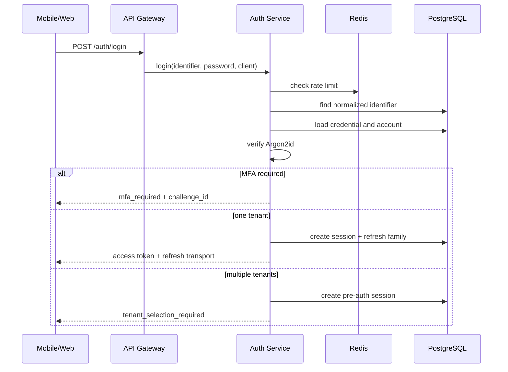
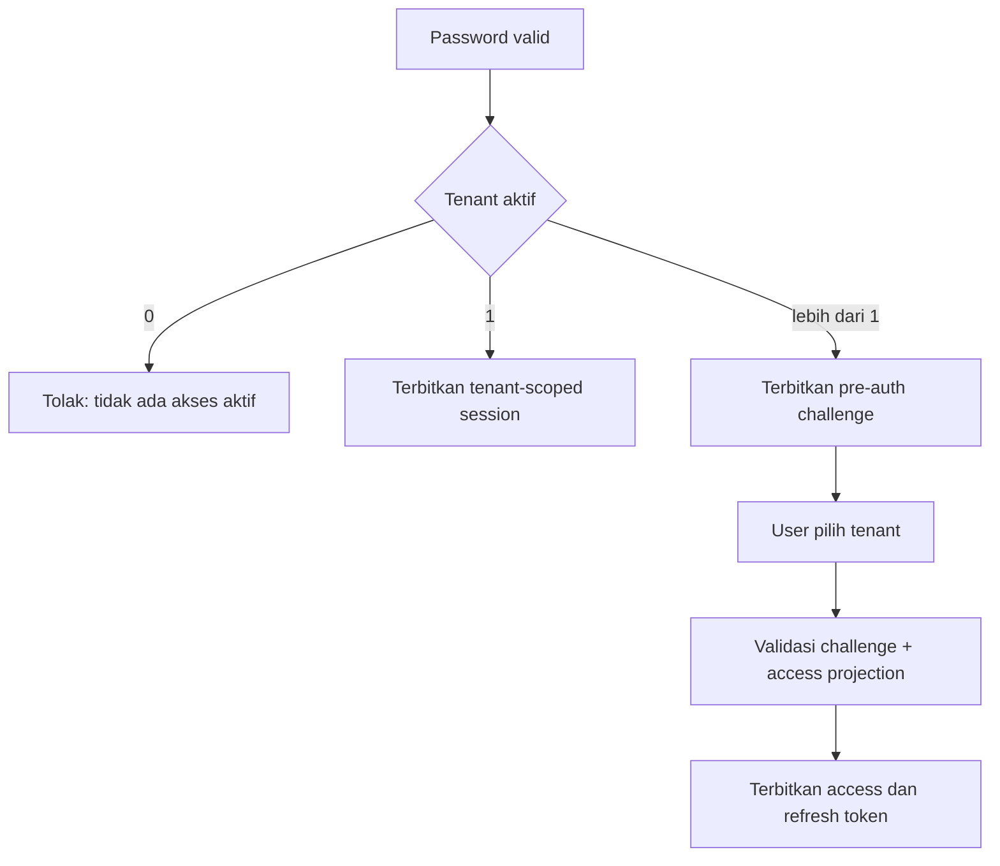
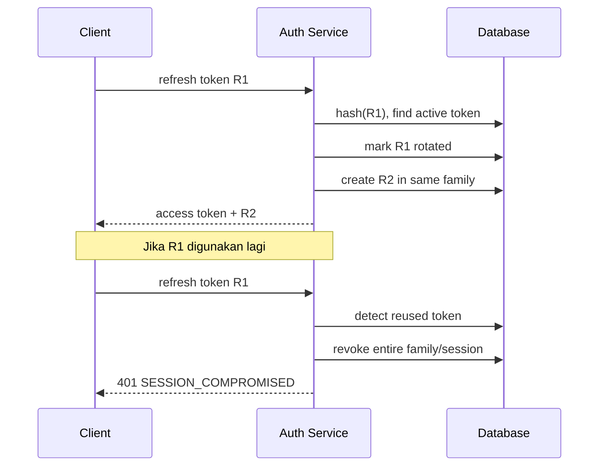

# User Flows

## 1. Login email atau phone



## 2. Login siswa/karyawan tanpa email

Request:

```json
{
  "tenantCode": "SCHOOL01",
  "identifier": "STU-2026-0012",
  "password": "temporary-password",
  "client": {
    "platform": "mobile",
    "deviceName": "Samsung A15"
  }
}
```

Flow:

1. Normalize `tenantCode`.
2. Resolve `tenant_id` melalui tenant access projection/tenant mapping.
3. Cari `tenant_username` pada tenant tersebut.
4. Verifikasi password.
5. Bila temporary password aktif, kembalikan `password_change_required`.
6. Setelah password diganti, buat session.
7. Terbitkan tenant-scoped token.

## 3. Multiple tenant selection



Pre-auth challenge:

- TTL 5 menit.
- Tidak dapat mengakses API bisnis.
- Hanya dapat memilih tenant atau menyelesaikan MFA.
- Sekali pakai.

## 4. Refresh token rotation



## 5. Forgot password

1. User memasukkan email/phone.
2. API selalu memberi response sukses generik.
3. Bila account cocok dan eligible, buat reset challenge.
4. Simpan hash token.
5. Emit event untuk Notification Service/provider adapter.
6. User membuka link atau memasukkan OTP.
7. Verifikasi challenge.
8. Simpan password baru.
9. Tandai challenge consumed.
10. Cabut session sesuai policy.
11. Emit `auth.password.changed`.

## 6. First login temporary password

1. Admin/People flow meminta temporary credential melalui internal API.
2. Auth membuat password acak atau menerima password yang memenuhi policy.
3. Credential diberi `must_change=true` dan expiry.
4. Login pertama hanya menghasilkan restricted challenge.
5. User memasukkan password baru.
6. Semua temporary credential dinonaktifkan.
7. Session normal dibuat.

## 7. Revoke perangkat

1. User membuka daftar sesi.
2. Auth menampilkan nama perangkat, waktu aktif, dan status current.
3. User mencabut sesi lain.
4. Session dan seluruh refresh token family dicabut.
5. Access token lama maksimal tetap berlaku sampai TTL pendek habis; critical service dapat melakukan session introspection bila diperlukan.
6. Event `auth.session.revoked` diterbitkan.

## 8. Account suspend

1. Admin berwenang mengirim command melalui gateway/internal control plane.
2. Auth mengubah status account.
3. Semua session dicabut.
4. Event diterbitkan.
5. Login berikutnya ditolak dengan pesan generik.
6. Apabila hanya tenant membership yang suspended, account masih dapat masuk ke tenant lain.

## 9. TOTP MFA

Setup:

1. User melakukan recent authentication.
2. Auth membuat secret sementara.
3. Client menampilkan QR.
4. User memasukkan OTP.
5. Auth memverifikasi dan mengaktifkan factor.
6. Recovery codes dibuat sekali dan hanya ditampilkan sekali.

Login:

1. Password valid.
2. Auth mengembalikan MFA challenge.
3. User memasukkan TOTP atau recovery code.
4. Setelah valid, session dibuat dengan `amr=["pwd","otp"]`.
