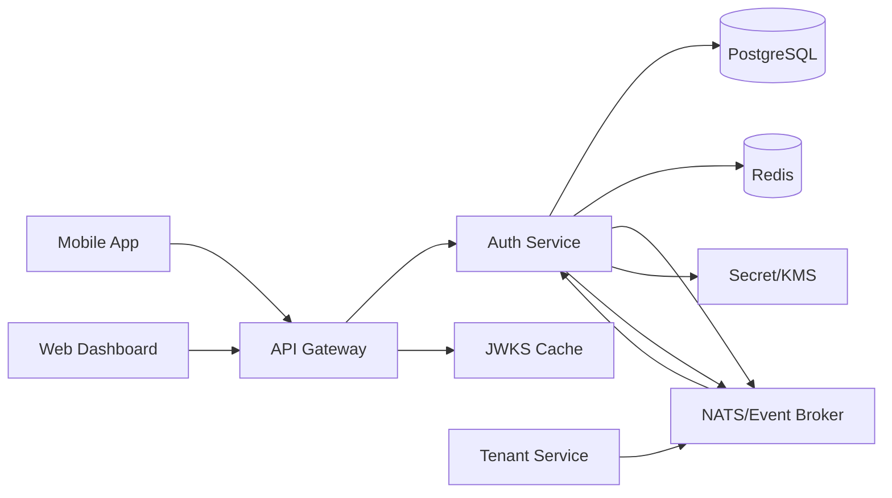

# Technical Design

## 1. Arsitektur



## 2. Komponen internal

```text
src/
├── bootstrap/
├── modules/
│   ├── accounts/
│   ├── identifiers/
│   ├── credentials/
│   ├── authentication/
│   ├── tenant-access/
│   ├── sessions/
│   ├── tokens/
│   ├── verification/
│   ├── recovery/
│   ├── mfa/
│   ├── jwks/
│   ├── audit/
│   └── health/
├── common/
│   ├── crypto/
│   ├── database/
│   ├── events/
│   ├── errors/
│   ├── logging/
│   ├── idempotency/
│   └── telemetry/
└── main.ts
```

Setiap module dianjurkan memiliki:

```text
domain/
application/
infrastructure/
transport/
```

## 3. Token architecture

### Access token

Format JWT, signed asymmetric. Pilihan awal:

- EdDSA/Ed25519 bila library dan seluruh consumer mendukung dengan baik.
- RS256 sebagai fallback interoperabilitas.

Algoritme harus dikunci di verifier; jangan mempercayai `alg` dari token tanpa allowlist.

Default:

| Properti | Nilai |
|---|---|
| TTL | 10 menit |
| Issuer | `https://auth.orgspace.internal` atau domain production |
| Audience | `orgspace-api` |
| Type | `at+jwt` |
| Key ID | Wajib |
| PII | Minimum |

Contoh claims:

```json
{
  "iss": "https://auth.example.com",
  "aud": "orgspace-api",
  "sub": "acc_01...",
  "sid": "ses_01...",
  "tid": "ten_01...",
  "azv": 12,
  "roles": ["employee"],
  "amr": ["pwd"],
  "auth_time": 1785588000,
  "jti": "jti_01...",
  "iat": 1785588000,
  "exp": 1785588600,
  "typ": "access"
}
```

Jangan memasukkan nama lengkap, nomor telepon, payroll, kelas, atau data wajah.

### Refresh token

Format:

```text
<token_id>.<random_secret>
```

- `token_id` membantu lookup tanpa menyimpan secret mentah.
- `random_secret` minimal 32 byte dari CSPRNG.
- Database menyimpan hash secret.
- Satu session memiliki token family.
- Rotation atomik dalam transaksi.
- Token lama ditandai `rotated`.
- Reuse token lama menyebabkan family revocation.

Default policy:

| Policy | Nilai |
|---|---|
| Idle expiry | 30 hari |
| Absolute session lifetime | 90 hari |
| Access token | 10 menit |
| Reset challenge | 15 menit |
| Email verification | 24 jam |
| MFA challenge | 5 menit |
| Pre-auth tenant challenge | 5 menit |

Nilai dapat dikonfigurasi, tetapi platform memiliki batas minimum/maksimum aman.

## 4. Web token transport

- Refresh token dikirim sebagai cookie `HttpOnly`.
- `Secure=true` di production.
- `SameSite=Lax` atau `Strict` sesuai alur.
- Cookie memiliki scoped path, misalnya `/v1/auth/refresh`.
- Access token disimpan di memory, bukan localStorage.
- Endpoint cookie-authenticated yang mengubah state harus mempertimbangkan CSRF protection.

## 5. Mobile token transport

- Refresh token disimpan di OS secure storage.
- Access token disimpan di memory.
- Token tidak ditulis ke log/crash report.
- Device identifier bukan hardware ID permanen; gunakan installation ID acak.
- Reinstall menghasilkan installation ID baru.

## 6. Tenant context

Account global dapat memiliki beberapa tenant. Token bisnis selalu tenant-scoped.

Aturan:

- `tid` wajib untuk endpoint bisnis.
- `azv` adalah authorization version.
- API Gateway menolak token tanpa tenant untuk route tenant-scoped.
- Saat membership berubah, Tenant Service mengirim event.
- Auth memperbarui projection dan menaikkan version.
- Token lama berumur pendek; route sangat sensitif dapat membandingkan version dengan cache.

## 7. Authorization projection

Tabel proyeksi menyimpan:

- account_id
- tenant_id
- membership_id
- status
- role keys
- authorization_version
- mfa policy
- updated_at
- source_event_id

Projection bukan sumber kebenaran organisasi. Bila event terlambat, reconciliation job memanggil internal endpoint Tenant Service atau memproses snapshot.

## 8. Password strategy

- Argon2id.
- Parameter disimpan bersama hash.
- Parameter dapat ditingkatkan.
- Saat login sukses, bila hash menggunakan parameter lama, lakukan rehash.
- Password tidak memiliki batas panjang kecil; tetap beri batas operasional untuk mencegah DoS.
- Jangan memakai pertanyaan keamanan.

Default product policy:

- Minimum 10 karakter untuk user biasa.
- Minimum 12 karakter untuk privileged account.
- Izinkan passphrase dan password manager.
- Tolak password yang sangat umum/terkompromi bila breach-check tersedia.
- Jangan memaksa rotasi berkala tanpa indikasi compromise.
- Temporary password harus diganti.

## 9. Rate limiting

Layer:

1. API Gateway coarse IP limit.
2. Auth Service identifier/IP/device limit.
3. Progressive delay.
4. Alert threshold.
5. Optional CAPTCHA/challenge setelah pola abuse.

Redis keys tidak boleh berisi email/phone plaintext; gunakan keyed hash.

## 10. Consistency dan transaction

Operasi berikut harus atomik:

- Create session + first refresh token.
- Rotate refresh token.
- Consume reset token + change password + revoke sessions.
- Enable MFA + consume setup challenge.
- Revoke token family + write audit + outbox.

Gunakan transactional outbox agar state database dan event tidak terpisah.

## 11. Key management

- Private key berasal dari KMS/secret manager atau mounted secret.
- Public keys dipublikasikan melalui JWKS.
- Satu key `active`, satu atau lebih `verifying`.
- Rotation:
  1. Tambah key baru ke JWKS.
  2. Jadikan key baru active.
  3. Pertahankan key lama sampai seluruh token kedaluwarsa.
  4. Retire key lama.
- Emergency rotation memiliki runbook khusus.

## 12. Observability

Metrics:

- login_attempt_total
- login_success_total
- login_failure_total by safe reason category
- token_refresh_total
- refresh_reuse_detected_total
- session_created_total
- session_revoked_total
- password_reset_requested_total
- mfa_challenge_total
- endpoint_latency
- db_pool_usage
- redis_errors
- outbox_lag

Trace dan log tidak boleh merekam password, OTP, access token, refresh token, reset token, TOTP secret, atau recovery code.
