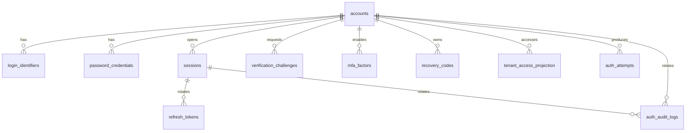

# Data Model

Database khusus: `orgspace_auth`.

Semua ID menggunakan UUIDv7/ULID atau format sortable lain yang konsisten.

## 1. Entity relationship

## 2. Tables

### `accounts`

| Column | Type | Notes |
|---|---|---|
| id | uuid | PK |
| status | varchar | pending_activation/active/locked/suspended/disabled/deleted |
| password_change_required | boolean | default false |
| locked_until | timestamptz nullable | temporary lock |
| failed_login_count | integer | informational; rate limit utama di Redis |
| last_login_at | timestamptz nullable | |
| created_at | timestamptz | |
| updated_at | timestamptz | |
| deleted_at | timestamptz nullable | soft deletion |

Tidak menyimpan nama lengkap atau profil organisasi.

### `login_identifiers`

| Column | Type | Notes |
|---|---|---|
| id | uuid | PK |
| account_id | uuid | FK |
| tenant_id | uuid nullable | hanya untuk tenant_username |
| type | varchar | email/phone/global_username/tenant_username |
| normalized_value | varchar | lookup |
| display_value | varchar | masked/display only |
| is_primary | boolean | |
| is_verified | boolean | |
| verified_at | timestamptz nullable | |
| created_at | timestamptz | |
| deleted_at | timestamptz nullable | |

Unique indexes:

- `(type, normalized_value)` untuk identifier global aktif.
- `(tenant_id, type, normalized_value)` untuk tenant username aktif.

Gunakan partial unique index untuk row non-deleted.

### `password_credentials`

| Column | Type | Notes |
|---|---|---|
| id | uuid | PK |
| account_id | uuid | FK |
| password_hash | text | Argon2id encoded hash |
| status | varchar | active/expired/revoked |
| is_temporary | boolean | |
| expires_at | timestamptz nullable | |
| created_at | timestamptz | |
| revoked_at | timestamptz nullable | |
| revoked_reason | varchar nullable | |

Hanya satu credential aktif normal per account.

### `password_history`

Menyimpan hash password lama sesuai policy. Jangan menyimpan plaintext.

### `sessions`

| Column | Type | Notes |
|---|---|---|
| id | uuid | PK |
| account_id | uuid | FK |
| active_tenant_id | uuid nullable | |
| status | varchar | active/revoked/compromised/expired |
| platform | varchar | web/mobile |
| installation_id_hash | varchar nullable | keyed hash |
| device_name | varchar nullable | sanitized |
| user_agent | text nullable | sanitized |
| ip_prefix | inet nullable | retention terbatas |
| auth_methods | jsonb | contoh `["pwd","otp"]` |
| authenticated_at | timestamptz | |
| last_seen_at | timestamptz | |
| idle_expires_at | timestamptz | |
| absolute_expires_at | timestamptz | |
| revoked_at | timestamptz nullable | |
| revoke_reason | varchar nullable | |

### `refresh_tokens`

| Column | Type | Notes |
|---|---|---|
| id | uuid | public token ID |
| session_id | uuid | FK |
| family_id | uuid | rotation family |
| secret_hash | bytea/text | keyed hash |
| status | varchar | active/rotated/revoked/reused/expired |
| parent_token_id | uuid nullable | rotation chain |
| issued_at | timestamptz | |
| expires_at | timestamptz | |
| rotated_at | timestamptz nullable | |
| revoked_at | timestamptz nullable | |
| reuse_detected_at | timestamptz nullable | |

Index:

- token `id`
- `(session_id, status)`
- `(family_id, status)`
- cleanup by `expires_at`

### `verification_challenges`

Dipakai untuk email verification, password reset, MFA challenge, pre-auth, first-login.

| Column | Type |
|---|---|
| id | uuid |
| account_id | uuid nullable |
| type | varchar |
| token_hash | text nullable |
| payload | jsonb |
| status | varchar |
| attempt_count | integer |
| max_attempts | integer |
| expires_at | timestamptz |
| consumed_at | timestamptz nullable |
| created_at | timestamptz |

Payload tidak boleh berisi password/OTP plaintext setelah tidak diperlukan.

### `mfa_factors`

| Column | Type | Notes |
|---|---|---|
| id | uuid | |
| account_id | uuid | |
| type | varchar | totp |
| encrypted_secret | bytea | envelope encryption |
| status | varchar | pending/active/disabled |
| created_at | timestamptz | |
| activated_at | timestamptz nullable | |
| disabled_at | timestamptz nullable | |

### `recovery_codes`

| Column | Type |
|---|---|
| id | uuid |
| account_id | uuid |
| code_hash | text |
| consumed_at | timestamptz nullable |
| created_at | timestamptz |

### `tenant_access_projection`

| Column | Type |
|---|---|
| account_id | uuid |
| tenant_id | uuid |
| membership_id | uuid |
| status | varchar |
| roles | jsonb |
| authorization_version | bigint |
| policies | jsonb |
| source_event_id | varchar |
| source_updated_at | timestamptz |
| projected_at | timestamptz |

Composite PK `(account_id, tenant_id)`.

### `auth_attempts`

Retention dibatasi.

| Column | Type |
|---|---|
| id | uuid |
| account_id | uuid nullable |
| identifier_fingerprint | varchar |
| outcome | varchar |
| reason_category | varchar |
| ip_prefix | inet nullable |
| installation_fingerprint | varchar nullable |
| created_at | timestamptz |

### `auth_audit_logs`

Append-only logical model.

| Column | Type |
|---|---|
| id | uuid |
| actor_type | varchar |
| actor_id | varchar nullable |
| account_id | uuid nullable |
| session_id | uuid nullable |
| tenant_id | uuid nullable |
| action | varchar |
| outcome | varchar |
| metadata | jsonb |
| request_id | varchar |
| created_at | timestamptz |

Metadata wajib melalui allowlist.

### `outbox_events`

| Column | Type |
|---|---|
| id | uuid |
| event_type | varchar |
| aggregate_type | varchar |
| aggregate_id | varchar |
| payload | jsonb |
| occurred_at | timestamptz |
| published_at | timestamptz nullable |
| attempt_count | integer |

### `idempotency_keys`

| Column | Type |
|---|---|
| key | varchar |
| operation | varchar |
| request_hash | varchar |
| response_status | integer |
| response_body | jsonb |
| expires_at | timestamptz |

## 3. Data retention

Default proposal:

- Auth attempt detail: 90 hari.
- Security audit: 1–2 tahun sesuai tenant/legal policy.
- Revoked refresh token metadata: sampai absolute session expiry + buffer.
- Expired challenge: 30 hari untuk audit, lalu purge.
- Deleted account: pseudonymize setelah retention/contract selesai.
- IP disimpan dalam bentuk prefix atau truncated bila cukup untuk security.

Kebijakan final harus diselaraskan dengan kebutuhan hukum dan kontrak.
